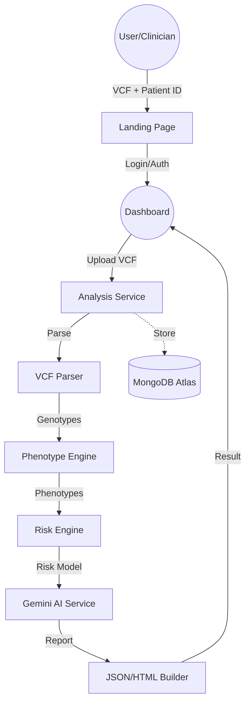

<p align="center">
  
</p>

<h1 align="center">🧬 PharmaGuard AI</h1>

<p align="center">
  <strong>AI-Powered Pharmacogenomics Decision Support System</strong><br/>
  <em>Turning genetic code into safer prescriptions — one variant at a time.</em>
</p>

<p align="center">
  
  
  
  
</p>

<p align="center">
  👤 <strong>Team:</strong> Neuron.dev &nbsp;|&nbsp; 🧑‍💻 <strong>Team :</strong> Ankit Kumar (Leader) <br>
  Mukesh Kumar <br>
  Deepa Tiwari <br>
  Abhisek Kumar <br>
</p>

---

## 🌐 Live Demo & Interactive Sandbox

> 🔗 **Public URL:** [https://pharma-gaurd.vercel.app/](https://pharma-gaurd.vercel.app/)  
> 🧪 **Try the Demo:** Check out the [Interactive Demo Report](https://pharma-gaurd.vercel.app/demo) (No login required)

---

## 📌 Table of Contents

- [Problem Statement](#-problem-statement)
- [Solution Overview](#-solution-overview)
- [Key Features](#-key-features)
- [Architecture](#-architecture)
- [Tech Stack](#-tech-stack)
- [Project Structure](#-project-structure)
- [Supported Drugs & Genes](#-supported-drugs--genes)
- [Getting Started](#-getting-started)
- [Roadmap](#-roadmap)

---

## ❗ Problem Statement

**Adverse Drug Reactions (ADRs)** are a leading cause of preventable hospitalizations. **One-size-fits-all prescribing** ignores the reality that our **genetic makeup** dictates how we metabolize drugs. Genetic variants in enzymes like CYP450 can make standard doses **toxic** for some and **ineffective** for others.

PharmaGuard AI bridges the gap between complex raw genomic data (VCF) and clinical action.

---

## 💡 Solution Overview

**PharmaGuard AI** is a professional pharmacogenomics analysis platform that transforms VCF genomic files into **actionable clinical reports** powered by the clinical guidelines (CPIC) and AI explainability.

### ✨ Why PharmaGuard AI?

| Feature | Description |
|---|---|
| 🎨 **Professional Landing** | High-impact, modern UI with clear value propositions and trust indicators. |
| 🔐 **Secure Auth** | Robust user management (MongoDB) with Role-Based Access Control (Clinicians vs. Researchers). |
| 🔬 **Hing-Fidelity Parsing** | Extracts pharmacogenomic variants (rsIDs) from standard VCF v4.2 files. |
| ⚠️ **Precise Risk Engine** | Categorizes risk as **Safe**, **Adjust Dosage**, or **Toxic** with confidence scores. |
| 🤖 **Gemini AI Explanations** | Utilizes Google Gemini 2.0 Flash to provide clinical-grade, human-readable explanations. |
| 📊 **Patient Dashboard** | Track historical analyses, patient status, and clinical summaries in real-time. |
| 🌓 **Modern Aesthetics** | Premium Dark/Light mode support with persistence and high-contrast accessibility. |

---

## 🏗️ Architecture



---

## 📂 Project Structure

```
PharmaGuard/
├── app.py                          # Main Flask application & Auth Routing
├── config.py                       # System configuration & API Keys
├── services/
│   ├── vcf_parser.py               # VCF extraction logic
│   ├── phenotype_engine.py         # rsID → Metabolizer mapping
│   ├── risk_engine.py              # Drug-gene risk classification
│   ├── gemini_service.py           # LLM Explanations (Gemini 2.0 Flash)
│   └── json_builder.py             # Structured response construction
├── templates/
│   ├── landing.html                # Professional Landing Page [NEW]
│   ├── dashboard.html              # User Analysis Center
│   ├── results.html                # Interactive Report View
│   ├── login.html / register.html  # Secure Authentication Views
├── static/
│   ├── css/style.css               # Modern Neon Design System
│   └── js/                         # Frontend logic (Theme toggle, etc.)
└── tests/
    └── verify_landing.py           # Routing verification scripts
```

---

## 🚀 Getting Started

### Prerequisites
- Python 3.10+
- MongoDB Instance (Atlas or Local)
- Google Gemini API Key

### Quick Start
```bash
# 1. Clone & Install
git clone https://github.com/ChikuX/PharmaGaurd.git
cd PharmaGaurd
pip install -r requirements.txt

# 2. Configure .env
# GEMINI_API_KEY=xxx
# MONGO_URI=xxx
# SECRET_KEY=xxx

# 3. Launch
python app.py
```

---

## 🗺️ Roadmap

- [x] 🗃️ **MongoDB Integration** — Persistent user and analysis storage.
- [x] 🔐 **Authentication** — Secure login/registration with Flask-Login.
- [x] 🎨 **Professional Landing Page** — Modern landing with interactive demo.
- [x] 🌗 **Theme Control** — Persistent Dark/Light mode.
- [ ] 🧬 **Expanded Gene Panel** — Addition of HLA-B and UGT1A1 support.
- [ ] 📄 **PDF Export** — Clinical-grade PDF report generation.
- [ ] 🏥 **EHR/FHIR Integration** — Standardized health data exchange.

---

<p align="center">
  Built with ❤️ by <strong>Team Neuron.dev</strong> for smarter, safer prescriptions.
</p>
